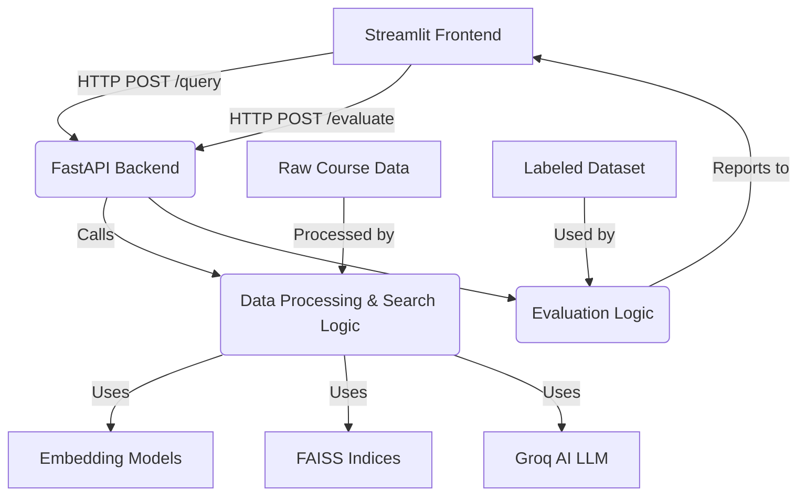

# Academic Course Search RAG API

This project implements an academic course search tool using a Retrieval-Augmented Generation (RAG) architecture. It leverages embedding models, FAISS for efficient vector search, keyword matching, and a Large Language Model (LLM) (Groq AI) to provide intelligent answers to user queries about academic courses. A Streamlit frontend offers an intuitive user interface with filtering capabilities.

## System Architecture

The application follows a client-server architecture with a FastAPI backend and a Streamlit frontend.

-   **FastAPI Backend (`app.py`)**: This is the core API server that handles all business logic.
    -   It loads pre-built FAISS indices and course metadata into memory during startup (`lifespan` event).
    -   Exposes a `/query` endpoint for course search, which performs hybrid retrieval and RAG using Groq AI.
    -   Exposes an `/evaluate` endpoint for assessing retrieval performance.
    -   Manages API key authentication and detailed logging.
-   **Streamlit Frontend (`frontend.py`)**: Provides an interactive web interface for users.
    -   Allows users to input natural language queries and apply various metadata filters.
    -   Communicates with the FastAPI backend via HTTP requests to retrieve and display search results and RAG-generated answers.
    -   Includes a button to trigger the RAG system evaluation.
-   **Data Processing (`data_processing.py`)**: A utility script responsible for:
    -   Loading and combining raw course data from different sources (e.g., Brown University, MIT OpenCourseWare).
    -   Generating dense vector embeddings for key course fields (title, description, prerequisites) using Sentence Transformers.
    -   Creating and saving FAISS indices for efficient similarity search, alongside their corresponding metadata.
-   **Embedding Models**: Uses `sentence-transformers/all-MiniLM-L6-v2` (and optionally `all-mpnet-base-v2`) to convert text into numerical vector representations.
-   **FAISS (Facebook AI Similarity Search)**: Utilized for high-performance similarity search over the generated course embeddings. Separate indices are maintained for different embedded fields to enhance search granularity.
-   **Groq AI**: A fast inference engine used as the generative LLM to synthesize natural language answers based on the retrieved course context.
-   **Evaluation (`evaluation.py`)**: Contains a labeled dataset and logic to measure the retrieval system's precision and recall.



## Design Decisions and Trade-offs

Here we outline key architectural and implementation decisions, along with their rationale and potential trade-offs.

1.  **Hybrid Search (Vector + Keyword)**
    *   **Decision**: Combine dense vector similarity search with traditional keyword matching.
    *   **Rationale**: Pure vector search can sometimes miss exact keyword matches, especially for specific course codes. Hybrid search ensures that both semantic relevance and lexical exactness are considered, leading to more robust retrieval. The `alpha` parameter allows tuning the balance between these two components. Aggressive boosting for exact course code matches ensures high recall for precise queries.
    *   **Trade-offs**: Increased complexity in the retrieval pipeline and potential for slight performance overhead compared to a single-method search. Requires careful tuning of `alpha` and boosting factors.

2.  **Multi-Field Embeddings and FAISS Indices**
    *   **Decision**: Generate separate embeddings and FAISS indices for different text fields (title, description, prerequisites).
    *   **Rationale**: Allows for more granular semantic matching. A query about "prerequisites" can specifically search the prerequisites embedding space, potentially yielding more accurate results than searching a concatenated "all text" embedding. It also provides flexibility to weigh different fields during retrieval.
    *   **Trade-offs**: Higher memory consumption due to multiple FAISS indices loaded into memory. Increased disk space for storing multiple index and metadata files. Retrieval logic becomes more complex when combining results from multiple fields.

3.  **FastAPI for Backend**
    *   **Decision**: Use FastAPI for building the API.
    *   **Rationale**: FastAPI is a modern, high-performance web framework for building APIs with Python 3.7+ based on standard Python type hints. It offers automatic interactive API documentation (Swagger UI/ReDoc), making development and testing easier. Its asynchronous support (`async/await`) is well-suited for I/O-bound tasks like calling LLMs or performing vector searches.
    *   **Trade-offs**: Requires understanding of asynchronous programming concepts.

4.  **Streamlit for Frontend**
    *   **Decision**: Utilize Streamlit for the user interface.
    *   **Rationale**: Streamlit enables rapid development of interactive web applications purely in Python, making it ideal for quick prototyping and internal tools without extensive web development knowledge.
    *   **Trade-offs**: Less customization flexibility compared to full-fledged JavaScript frameworks (React, Vue) for complex UI/UX designs. Performance can sometimes be an issue for highly interactive components or very large datasets displayed directly.

5.  **Groq AI for Generative LLM**
    *   **Decision**: Employ Groq AI for generating responses.
    *   **Rationale**: Groq is known for its extremely fast inference speeds, which significantly reduces the latency of the RAG generation step, improving the overall user experience.
    *   **Trade-offs**: Dependent on Groq API availability and pricing. Model choices are limited to those offered by Groq.

6.  **Basic Token Authentication (X-API-Key)**
    *   **Decision**: Implement a simple token-based authentication mechanism using an `X-API-Key` header.
    *   **Rationale**: Provides a straightforward way to secure API endpoints, preventing unauthorized access, especially for internal tools or private deployments.
    *   **Trade-offs**: Not as robust as OAuth2 or JWT for large-scale, multi-user applications requiring fine-grained access control. Key management and rotation need to be handled carefully.

7.  **Micro-averaged Precision and Recall**
    *   **Decision**: Use micro-averaged precision and recall for evaluation.
    *   **Rationale**: Micro-averaging gives equal weight to each individual (document, query) pair, making it suitable when there's a class imbalance or when overall performance across all documents is important, rather than performance per query. It is a common metric for information retrieval systems.
    *   **Trade-offs**: May not highlight performance issues on rare queries as effectively as macro-averaging, which treats each query equally regardless of the number of relevant documents.

## Features

-   **Hybrid Search**: Combines semantic vector similarity search (using Sentence Transformers and FAISS) with keyword matching for robust retrieval.
-   **Multi-Field Embeddings**: Course data (title, description, prerequisites) is embedded separately for more granular relevance matching.
-   **Flexible Filtering**: Users can filter search results by institute, department, instructor, meeting times, and prerequisites.
-   **Generative AI Responses**: Uses Groq AI to generate natural language answers based on retrieved course context.
-   **Streamlit Frontend**: A user-friendly web interface for asking queries and applying filters.
-   **API Endpoints**: FastAPI backend providing `/query` and `/evaluate` endpoints.
-   **Basic Token Authentication**: Secure API access using an `X-API-Key` header.
-   **Comprehensive Logging**: Detailed logging of queries, retrieval processes, scores, and response times for monitoring and debugging.
-   **Precision/Recall Evaluation**: An integrated mechanism to evaluate retrieval performance (micro-averaged precision and recall) against a labeled dataset.

## Setup

Follow these steps to set up and run the application locally.

### 1. Clone the Repository

```bash
git clone <repository_url> # Replace with your repository URL
cd Academic-Course-Search-Tool
```

### 2. Create and Activate a Virtual Environment

It's highly recommended to use a virtual environment to manage dependencies.

```bash
python -m venv .rag
source .rag/bin/activate  # On Windows, use `.\.rag\Scripts\activate`
```

### 3. Install Dependencies

Install all required Python packages using `pip`:

```bash
pip install -r requirements.txt
```

### 4. Configure API Keys

The application requires API keys for Groq AI and for internal API authentication.

-   **`GROQ_API_KEY`**: Obtain this from [Groq Cloud](https://console.groq.com/). You can set it as an environment variable or directly in `app.py` (though environment variables are recommended for production).
-   **`API_KEY`**: This is for internal authentication of your FastAPI endpoints. **Change `YOUR_SECRET_API_KEY` in `app.py` and `evaluation.py` (and potentially `frontend.py` if hardcoded for local testing) to a strong, unique secret key.** For production, load this from an environment variable.

    Example environment variable setup (for Linux/macOS):
    ```bash
    export GROQ_API_KEY="gsk_YOUR_GROQ_API_KEY"
    export API_KEY="YOUR_STRONG_SECRET_API_KEY"
    ```

### 5. Generate FAISS Indices and Metadata

This is a crucial step. The `data_processing.py` script preprocesses your course data, creates embeddings for different fields (title, description, prerequisites), and builds the FAISS indices that the search API uses.

```bash
python data_processing.py
```

This script will output messages indicating its progress and confirm when indices and metadata files (e.g., `faiss_index_MiniLM_title.faiss`, `course_metadata_MiniLM_description.json`) have been saved. Ensure this step completes without errors.

## Running the Application

The application consists of a FastAPI backend and a Streamlit frontend. Both need to be running concurrently.

### 1. Start the FastAPI Backend

Open your terminal, navigate to the project root, activate your virtual environment, and run the backend. **It's important to use a sufficient timeout, especially for the evaluation endpoint.**

```bash
source .rag/bin/activate
uvicorn app:app --reload --timeout 300
```

The `--timeout 300` flag sets the server timeout to 300 seconds (5 minutes), which is helpful for long-running evaluation requests.

### 2. Start the Streamlit Frontend

Open a **new terminal window**, navigate to the project root, activate your virtual environment, and run the frontend:

```bash
source .rag/bin/activate
streamlit run frontend.py
```

This will open the Streamlit application in your web browser.

## Usage

### Frontend (Streamlit)

Access the Streamlit application via your browser (usually `http://localhost:8501`).

-   **Ask a Question**: Type your course query into the text area.
-   **Filters**: Use the sidebar controls to filter by Institute, Department, Instructor, Meeting Times, or Prerequisites.
-   **Search Courses**: Click this button to get RAG-generated answers and a list of retrieved courses.
-   **Evaluate RAG System**: Click this button in the sidebar to run the full evaluation pipeline and see precision/recall metrics.

### Backend API (Directly)

You can interact with the FastAPI backend directly using tools like `curl`, Postman, or a custom script. Remember to include the `X-API-Key` header for authenticated endpoints.

-   **Health Check**: `GET /health` (no authentication needed)
-   **Query Endpoint**: `POST /query` (requires `X-API-Key`)
    Example `curl` (replace `YOUR_SECRET_API_KEY`):
    ```bash
    curl -X 'POST' \
      'http://127.0.0.1:8000/query' \
      -H 'accept: application/json' \
      -H 'Content-Type: application/json' \
      -H 'X-API-Key: YOUR_SECRET_API_KEY' \
      -d '{
        "question": "What are the prerequisites for AFRI 0090?",
        "top_k": 5,
        "alpha": 0.2,
        "embedding_model": "MiniLM",
        "filters": {"institute": "Brown University"}
      }'
    ```
-   **Evaluate Endpoint**: `POST /evaluate` (requires `X-API-Key`)
    Example `curl` (replace `YOUR_SECRET_API_KEY`):
    ```bash
    curl -X 'POST' \
      'http://127.0.0.1:8000/evaluate' \
      -H 'accept: application/json' \
      -H 'X-API-Key: YOUR_SECRET_API_KEY'
    ```

## Evaluation Details

The evaluation process calculates micro-averaged precision and recall over a predefined `LABELED_DATASET` in `evaluation.py`.

-   **`evaluation.py`**: Contains the `LABELED_DATASET` (a list of queries with their expected relevant course codes) and the `evaluate_rag_system` function.
    -   **Expand `LABELED_DATASET`**: For more robust evaluation, you should significantly expand this dataset with diverse queries and comprehensive lists of truly relevant `expected_course_codes`.
    -   **Top-K for Evaluation**: The `top_k` value used during evaluation (`payload[\"top_k\"]` in `evaluate_rag_system`) directly impacts precision and recall. Adjust this value in `evaluation.py` to analyze performance at different retrieval depths.

## Adding Additional Datasets

To expand the course coverage of the search tool, you can integrate new datasets by following these steps:

1.  **Data Extraction**: Create a new Python script (e.g., `new_uni_data_extraction.py`) that extracts course information from your desired source and transforms it into a Pandas DataFrame. This DataFrame should have consistent column names with existing datasets (e.g., `institute`, `course_code`, `title`, `description`, `instructor`, `meeting_times`, `prerequisites`, `department`).

2.  **Integrate into `data_processing.py`**: Open `data_processing.py` and modify the `load_and_combine_course_data` function:
    *   Import your new data extraction function (e.g., `from new_uni_data_extraction import get_new_uni_courses_dataframe`).
    *   Call your new data extraction function to get its DataFrame.
    *   Add this new DataFrame to the `pd.concat` list to combine it with existing course data.

    ```python
    # Example modification in data_processing.py
    from brown_data_extraction import get_brown_courses_dataframe
    from mit_data_extraction import get_mit_courses_dataframe
    from new_uni_data_extraction import get_new_uni_courses_dataframe # New import

    def load_and_combine_course_data() -> pd.DataFrame:
        # ... existing loading ...
        new_uni_df = get_new_uni_courses_dataframe()
        combined_df = pd.concat([brown_df, mit_df, new_uni_df], ignore_index=True) # Add new_uni_df
        return combined_df
    ```

3.  **Regenerate FAISS Indices**: After modifying `data_processing.py`, you must regenerate the FAISS indices to include the new course data.

    ```bash
    python data_processing.py
    ```

    This will create new FAISS index files and metadata JSON files that incorporate your additional dataset.

4.  **Update Frontend Filters (Optional)**: If your new dataset introduces new institutes or departments you want to filter by, you might need to update the options in `frontend.py`'s `st.sidebar.selectbox` widgets.

## Deployment on AWS (Containerized Application)

This application is designed to be containerized using Docker, which simplifies deployment to various cloud platforms, including AWS. Below are general instructions for deploying your Dockerized FastAPI backend and Streamlit frontend on AWS.

### Prerequisites

-   An AWS account with appropriate IAM permissions.
-   AWS CLI configured on your local machine.
-   Docker installed and running locally.

### 1. Build and Push Docker Images

First, you need to build the Docker image for your FastAPI backend and push it to an Amazon Elastic Container Registry (ECR) repository.

1.  **Create an ECR Repository**: Navigate to ECR in the AWS Console and create a new repository (e.g., `course-search-backend`).

2.  **Authenticate Docker to ECR**:

    ```bash
    aws ecr get-login-password --region <your-aws-region> | docker login --username AWS --password-stdin <aws_account_id>.dkr.ecr.<your-aws-region>.amazonaws.com
    ```

3.  **Build and Tag the Image**:

    ```bash
    docker build -t course-search-backend .
    docker tag course-search-backend:latest <aws_account_id>.dkr.ecr.<your-aws-region>.amazonaws.com/course-search-backend:latest
    ```

4.  **Push the Image to ECR**:

    ```bash
    docker push <aws_account_id>.dkr.ecr.<your-aws-region>.amazonaws.com/course-search-backend:latest
    ```

    You would repeat a similar process for the Streamlit frontend if you decide to containerize it separately (recommended for robust production deployments) or deploy it directly on an EC2 instance.

### 2. Deployment Options on AWS

#### Option A: Amazon EC2 (Elastic Compute Cloud)

For simplicity and full control, you can deploy both backend and frontend on a single EC2 instance (or separate instances for scalability).

1.  **Launch an EC2 Instance**: Choose an appropriate instance type (e.g., `t3.medium` or `t3.large` for both) and an Amazon Machine Image (AMI) with Docker pre-installed (e.g., Amazon Linux 2 with Docker).

2.  **SSH into EC2**: Connect to your EC2 instance via SSH.

3.  **Install Docker Compose (if deploying both on one instance)**:

    ```bash
    sudo curl -L "https://github.com/docker/compose/releases/download/v2.20.2/docker-compose-$(uname -s)-$(uname -m)" -o /usr/local/bin/docker-compose
    sudo chmod +x /usr/local/bin/docker-compose
    ```

4.  **Pull and Run Docker Images**: Authenticate Docker to ECR on the EC2 instance, pull your backend image, and run it. For the frontend, you can clone the repository and run `streamlit run frontend.py` or deploy its own Docker image.

    -   **Backend (`app.py` in Docker)**: Run the Docker container, exposing port 8000.
        ```bash
        docker run -d -p 8000:8000 --name backend-api -e GROQ_API_KEY="gsk_..." -e API_KEY="..." <aws_account_id>.dkr.ecr.<your-aws-region>.amazonaws.com/course-search-backend:latest
        ```

    -   **Frontend (`frontend.py`)**: You can run it directly on the EC2 instance or as another Docker container, exposing port 8501.
        *Remember to update `frontend.py`'s `BACKEND_URL` to point to the EC2 instance's public IP or internal DNS of the backend container if on the same instance.* `http://localhost:8000` might work if both are on the same Docker network.

5.  **Security Groups**: Ensure your EC2 instance's security group allows inbound traffic on ports 8000 (for FastAPI) and 8501 (for Streamlit).

#### Option B: Amazon ECS (Elastic Container Service)

For more scalable and managed container orchestration, consider ECS.

1.  **Create an ECS Cluster**: Set up an ECS cluster (Fargate or EC2 launch type).

2.  **Task Definitions**: Create Task Definitions for your FastAPI backend and Streamlit frontend. Specify:
    *   The Docker image URI from ECR.
    *   Container port mappings (8000 for backend, 8501 for frontend).
    *   Environment variables (e.g., `GROQ_API_KEY`, `API_KEY`, `BACKEND_URL` for the frontend).
    *   CPU and memory requirements.

3.  **ECS Services**: Create ECS Services to run and maintain the desired number of tasks (instances) of your backend and frontend. Associate them with a Load Balancer (Application Load Balancer) for traffic distribution.

4.  **Load Balancer and Target Groups**: Configure an Application Load Balancer (ALB) to route traffic to your ECS services. Create target groups for the backend (port 8000) and frontend (port 8501).

5.  **Networking (VPC, Security Groups)**: Ensure your ECS cluster and services are deployed within a properly configured VPC with appropriate security groups allowing inter-service communication and external access via the ALB.

#### Option C: Amazon Lightsail

For simpler, cost-effective deployments, especially for smaller projects or testing, Lightsail offers an easier path.

1.  **Create a Lightsail Instance**: Choose a Linux instance (e.g., Ubuntu) and enable the option to install Docker during instance creation.

2.  **SSH into Lightsail**: Connect to your Lightsail instance via its web-based SSH client or your local terminal.

3.  **Pull and Run Docker Images**: Similar to EC2, pull your Docker images from ECR and run them. Update `frontend.py`'s `BACKEND_URL` to point to the Lightsail instance's private IP or DNS for inter-container communication.

    ```bash
    # Example to run backend
    docker run -d -p 8000:8000 --name backend-api -e GROQ_API_KEY="gsk_..." -e API_KEY="..." <aws_account_id>.dkr.ecr.<your-aws-region>.amazonaws.com/course-search-backend:latest

    # Example to run frontend (if containerized)
    docker run -d -p 8501:8501 --name frontend-app -e BACKEND_URL="http://<backend-private-ip>:8000" -e API_KEY="..." <your-frontend-image>
    ```

4.  **Lightsail Firewall**: Configure the Lightsail instance's firewall to open ports 8000 and 8501.

## Troubleshooting

-   **`ModuleNotFoundError: No module named 'aiohttp'`**: Run `pip install aiohttp`.
-   **`KeyError: 'MiniLM'`**: Ensure `data_processing.py` has been run successfully to generate all multi-field FAISS indices, and restart the FastAPI backend.
-   **`Read timed out`**: Increase the Uvicorn server timeout when starting the backend (e.g., `uvicorn app:app --reload --timeout 300`).
-   **Incorrect Evaluation Metrics**: Review your `LABELED_DATASET` to ensure `expected_course_codes` are accurate and comprehensive for each query. Adjust `top_k` in `evaluation.py` and `alpha` in `frontend.py` (and potentially in `evaluation.py`) to fine-tune retrieval balance.
